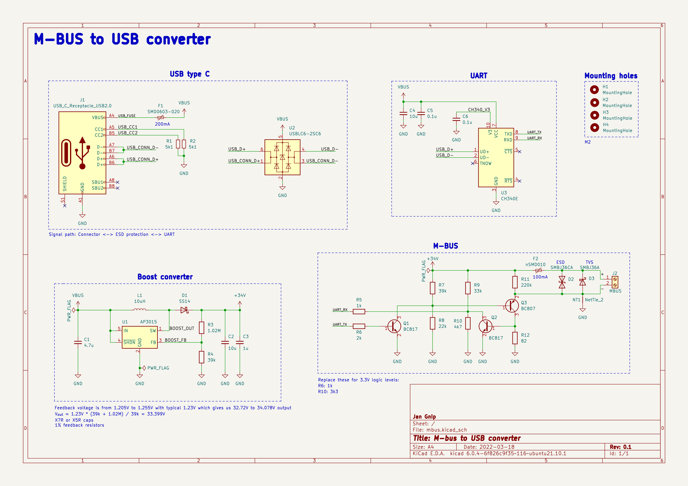

# M-bus to USB board
* KiCAD 6.X required 
* includes ESD (USB+MBUS) and TVS (MBUS) protections
* includes AP3015 stepup from 5V -> 34V
* includes CH340E UART IC

## Software
Tested with https://github.com/ganehag/pyMeterBus library.

## 5V vs 3.3V note 
CH340E is 5V only IC without additional 3.3V regulator. Even its RX/TX pins are 5V.
Use PL2303GL instead when CH340E is not available and change MBUS logic to 3.3V (replace R6 and R10).

## Board overview

